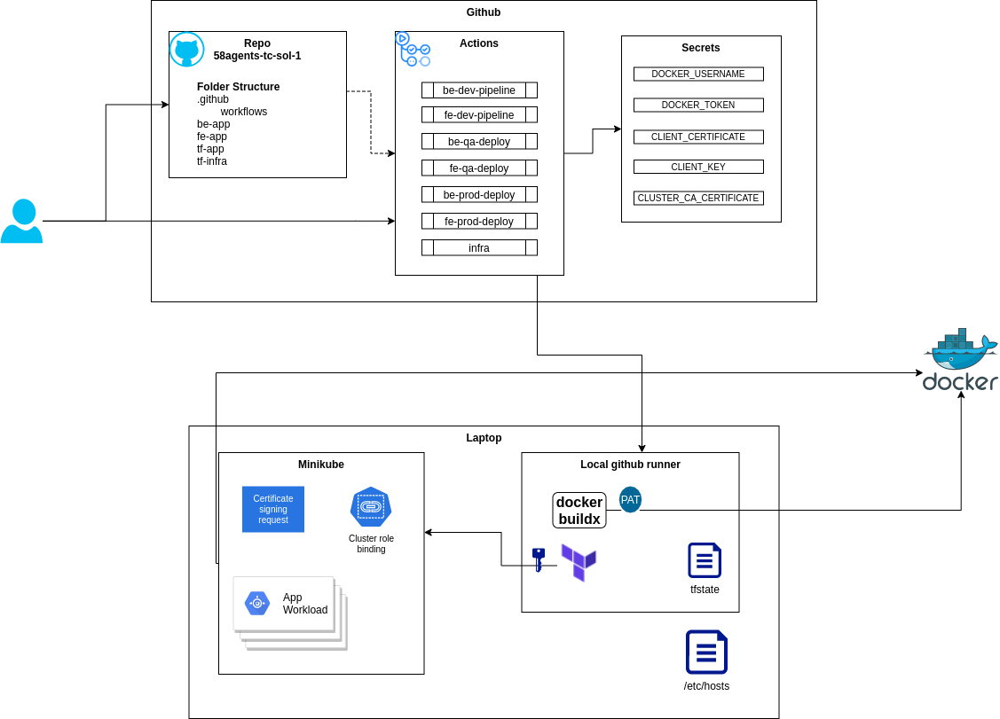

# Introduction

This document serves as a detailed overview of my approach and solutions to the [technical challenge](tech_challenge.md) presented as part of the application process. The challenge provided an exciting opportunity to showcase my technical skills, problem-solving abilities, and approach to delivering efficient, reliable solutions. 

In the following sections, I will outline my methodology, the tools and technologies I used, and the steps I took to address the specific requirements of the challenge. I approached this task with a focus on best practices, scalability, and code quality to ensure a robust outcome. 

I look forward to any feedback you may have and hope this documentation reflects my commitment to excellence and continuous learning.

# Prerequisites

To ensure a smooth setup and execution of the challenge, please complete the following steps:

1. **Install Minikube and Enable Ingress Add-On**  
  - Install [Minikube](https://minikube.sigs.k8s.io/docs/start/) on your local environment.
  - Enable the Ingress add-on in Minikube:
     ```bash
     minikube addons enable ingress
     ```

2. **Install and Configure GitHub Runner**  
  - Set up a [self-hosted GitHub runner](https://docs.github.com/en/actions/hosting-your-own-runners/about-self-hosted-runners) to allow GitHub Actions to run workflows in your environment.

3. **Install Docker Buildx and Terraform**  
  - Install Docker Buildx to enable advanced buildoptions for Docker images:
    ```bash
    # Docker Buildx installation steps
    ```
  - Install [Terraform](https://www.terraform.io/downloads) for managing infrastructure as code.

4. **Generate Kubernetes Credentials for Terraform User**  
  - Generate a public key and CSR (Certificate SigningRequest) for the Terraform user.
  - Create the CSR in Kubernetes:
    ```yaml
    #example of csr.yaml
    apiVersion: certificates.k8s.io/v1
    kind: CertificateSigningRequest
    metadata:
      name: terraform
    spec:
      request: <BASE64_CSR>
      signerName: kubernetes.io/kube-apiserver-client
      expirationSeconds: 86400  # one day
      usages:
      - client auth
    ```

    ```bash
    kubectl apply -f csr.yaml
    # approve
    kubectl certificate approve terraform
    ```
  - Bind the Terraform user to the required clusterroles:
    ```yaml
    # example cluster role binding
    apiVersion: rbac.authorization.k8s.io/v1
    kind: ClusterRoleBinding
    metadata:
      creationTimestamp: null
      name: admin-binding-terraform
    roleRef:
      apiGroup: rbac.authorization.k8s.io
      kind: ClusterRole
      name: cluster-admin
    subjects:
    - apiGroup: rbac.authorization.k8s.io
      kind: User
      name: terraform
    ```
    ```bash
    kubectl apply -f cluster_role_binding.yaml
    ```
   - Download the client certificate
   ```bash
   kubectl get csr terraform -o jsonpath='{.status.certificate}' | base64 -d > tf.crt
   ```
   - Use the downloaded client certificate, client key, and cluster CA certificate (~/.minikube/ca.crt) in the terraform provider block (step 6.).

5. **Create Personal Access Token for Docker Hub**  
  - Generate a personal access token on [Docker Hub(https://hub.docker.com/) to allow access for imagepushes.

6. **Store Credentials in GitHub Secrets**  
  - Store the following credentials securely as GitHub ecrets to enable GitHub Actions to access them:
    - `client_certificate`: Client certificate for Kubernetes
    - `client_key`: Client key for Kubernetes
    - `cluster_ca_certificate`: Cluster CA certificate for Kubernetes
    - `dockerhub_username`: Docker Hub username
    - `dockerhub_password`: Docker Hub password

7. **Adjust /etc/hosts**
  - adjust the '/etc/hosts' file to resolve the hosts configured in the ingresses. Following domains need to be added, and assigned to the IP address of minikube:
    - app.dev
    - app.qa
    - app.prod
    - kuma.env

Ensure all the above steps are completed before proceeding with the challenge to avoid setup issues. 

# Landscape

## Tools used
- Github as repository
- Github actions as CI/CD tool
- Terraform to deploy the workload to kubernetes
- Dockerhub as image registry

## Landscape diagram



# Workload

## Workload diagram


# Deployment

## Workflow

1. The namespaces, Uptime-kuma and the databases will be provisioned with the 'infra' workflow.
1. Pushing to main will trigger the workflow to build the image and deploy the workload to the dev environment.
1. Promoting to QA will be handled manually, by triggering the QA workflow. In this step, the image tag that is currently in the tfstate file of the dev environement will be fetched, and used in the terraform deployment resource.
1. The prod-release workflow will be trigger by creating a new tag with format vX.Y.Z format.


## Deployment diagram


# Notes

- due to simplicity, the whole codebase, for infra, Fe and Be, ind stored in one repository. It would be better to seperate them.
- it would be better to deploy the workload with the gitops approach, using Flux or ArgoCD.
- PostgreSQL username and password is hardcoded in the backend python app. An secrets manager/vault should be used instead
- local terraform backend is used, and the tfstate files are stored in _work folder of the actions-runner. A better solution should used to store the tfstate file, which is more secure and provide the lock feature.
  - I tried to store it in Kubernetes using the kubernetes backend, but after I lost an hour or two, because I couldn't handle the authentication, I switched to local.
- Certificate for for terraform is expiring in 24 hours. This could be, either automated or issued with longer expiration time.
- instead of manually trigger the QA workflows, an approval step could be implemented.
- The prod workflow will be triggered by every tag that fits the regex. With this in mind a lower version then the current could also trigger the workflow. It should be considered implement a rule which denies such triggers.