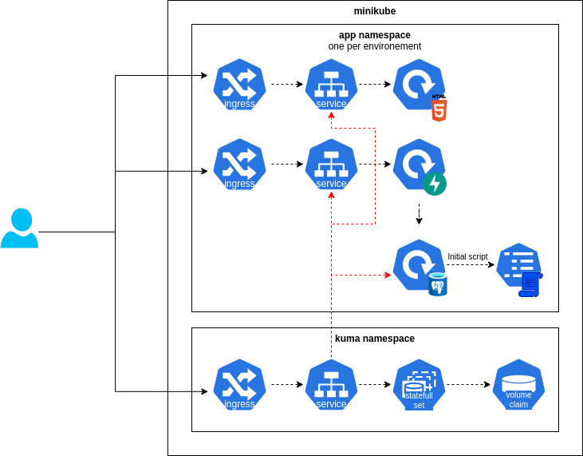

# Introduction

This document serves as a detailed overview of my approach and solutions to the [technical challenge](tech_challenge.md) presented as part of the application process. The challenge provided an exciting opportunity to showcase my technical skills, problem-solving abilities, and approach to delivering efficient, reliable solutions. 

In the following sections, I will outline my methodology, the tools and technologies I used, and the steps I took to address the specific requirements of the challenge. I approached this task with a focus on best practices, scalability, and code quality to ensure a robust outcome. 

I look forward to any feedback you may have and hope this documentation reflects my commitment to excellence and continuous learning.

# Prerequisites

To ensure a smooth setup and execution of the challenge, please complete the following steps:

1. **Install Minikube and Enable Ingress Add-On**  
  - Install [Minikube](https://minikube.sigs.k8s.io/docs/start/) on your local environment.
  - Enable the Ingress add-on in Minikube:
     ```bash
     minikube addons enable ingress
     ```

2. **Install and Configure GitHub Runner**  
  - Set up a [self-hosted GitHub runner](https://docs.github.com/en/actions/hosting-your-own-runners/about-self-hosted-runners) to allow GitHub Actions to run workflows in your environment.

3. **Install Docker Buildx and Terraform**  
  - Install [Docker Buildx](https://github.com/docker/buildx) to enable advanced buildoptions for Docker images.
  - Install [Terraform](https://www.terraform.io/downloads) for managing infrastructure as code.

4. **Generate Kubernetes Credentials for Terraform User**  
  - [How to issue a certificate for a user](https://kubernetes.io/docs/reference/access-authn-authz/certificate-signing-requests/#normal-user)
  - Generate a public key and CSR (Certificate SigningRequest) for the Terraform user.
    ```bash
    openssl genrsa -out tf.key 2048
    openssl req -new -key tf.key -out tf.csr -subj "/CN=terraform"
    ```
  - Create the CSR in Kubernetes:
    ```bash
    # create base64 of tf.csr
    cat myuser.csr | base64 | tr -d "\n"
    ```

    ```yaml
    #example of csr.yaml
    apiVersion: certificates.k8s.io/v1
    kind: CertificateSigningRequest
    metadata:
      name: terraform
    spec:
      request: <BASE64_CSR>
      signerName: kubernetes.io/kube-apiserver-client
      expirationSeconds: 86400  # one day
      usages:
      - client auth
    ```

    ```bash
    kubectl apply -f csr.yaml
    # approve
    kubectl certificate approve terraform
    ```
  - Bind the Terraform user to the required clusterroles:
    ```yaml
    # example cluster role binding
    apiVersion: rbac.authorization.k8s.io/v1
    kind: ClusterRoleBinding
    metadata:
      creationTimestamp: null
      name: admin-binding-terraform
    roleRef:
      apiGroup: rbac.authorization.k8s.io
      kind: ClusterRole
      name: cluster-admin
    subjects:
    - apiGroup: rbac.authorization.k8s.io
      kind: User
      name: terraform
    ```
    ```bash
    kubectl apply -f cluster_role_binding.yaml
    ```
   - Download the client certificate
   ```bash
   kubectl get csr terraform -o jsonpath='{.status.certificate}' | base64 -d > tf.crt
   ```
   - Use the downloaded client certificate, client key, and cluster CA certificate (~/.minikube/ca.crt) in the terraform provider block (step 6.).

5. **Create Personal Access Token for Docker Hub**  
  - Generate a personal access token on [Docker Hub(https://hub.docker.com/) to allow access for image pushes.

6. **Store Credentials in GitHub Secrets**  
  - Store the following credentials securely as GitHub ecrets to enable GitHub Actions to access them:
    - `client_certificate`: Client certificate for Kubernetes
    - `client_key`: Client key for Kubernetes
    - `cluster_ca_certificate`: Cluster CA certificate for Kubernetes
    - `dockerhub_username`: Docker Hub username
    - `dockerhub_password`: Docker Hub password

7. **Adjust /etc/hosts**
  - adjust the '/etc/hosts' file to resolve the hosts configured in the ingresses. Following domains need to be added, and assigned to the IP address of minikube:
    - app.dev
    - app.qa
    - app.prod
    - kuma.env
  ```
  # example
  192.168.49.2 app.dev
  192.168.49.2 app.qa
  192.168.49.2 app.prod
  192.168.49.2 kuma.env
  ```

Ensure all the above steps are completed before proceeding with the challenge to avoid setup issues. 

# Landscape

## Tools used

The following tools were used to manage the application’s code, infrastructure, and deployment pipeline:

- **GitHub**: Used as the primary code repository to manage source code and track changes.
- **GitHub Actions**: Employed as the CI/CD tool to automate testing, building, and deployment workflows.
- **Minikube**: Set up to run a local, single-node Kubernetes cluster for development and testing.
- **Terraform**: Utilized to define and deploy infrastructure as code, provisioning the workload on Kubernetes.
- **Docker Hub**: Used as the container image registry to store and manage Docker images.

## Landscape diagram


# Workload

The application workload is structured across multiple stages and namespaces as follows:

1. **Stages**  
   There are three stages, each in its own namespace: `dev`, `qa`, and `prod`. Each stage includes:
   - **Frontend Service**: Developed with HTML and JavaScript, served by an Apache Web Server.
   - **Backend Service**: Built with Python using the FastAPI framework to handle API requests and business logic.
   - **PostgreSQL Database**: Used as the primary database for data persistence.

2. **Monitoring Namespace**  
   - A dedicated namespace is set up for **Uptime-Kuma**, a monitoring tool used to track the uptime and health of the services across the stages.

## Workload diagram



# Deployment

## Workflow

1. **Infrastructure Provisioning with `infra` Workflow**  
   - The `infra` workflow is responsible for provisioning the necessary namespaces, deploying Uptime-Kuma, and setting up databases required by the application.

2. **Automated Deployment to Development Environment**  
   - Pushing changes to the `main` branch will trigger a workflow that builds the application’s Docker image and deploys the workload to the development environment.

3. **Manual Promotion to QA Environment**  
   - Promotion to the QA environment is done manually by triggering the QA workflow.
   - In this step, the image tag currently stored in the Terraform state file of the development environment is retrieved and used in the Terraform deployment resource for QA.

4. **Production Release**  
   - The `prod-release` workflow is triggered by creating a new tag in the format `vX.Y.Z`.
   - The image tag is fetched from the QA environment's Terraform state file, ensuring the QA-tested image is deployed to production.


## Deployment diagram


# Notes

- For simplicity, the entire codebase (infrastructure, frontend, and backend) is stored in a single repository. Ideally, these components should be separated into individual repositories.
- A GitOps approach (using tools like **Flux** or **ArgoCD**) would be preferable for deploying the workload, as it would enhance consistency and reliability.
- **PostgreSQL** credentials (username and password) are currently hardcoded in the backend Python application. Using a secrets manager or vault would be a more secure solution.
- A local Terraform backend is used, with `tfstate` files stored in the `_work` folder of the Actions runner. A more secure and robust solution should be implemented to store the `tfstate` files, preferably one that supports locking.
   - Although an attempt was made to use the Kubernetes backend for `tfstate` storage, authentication issues took significant time to troubleshoot, leading to a switch to the local backend.
- The certificate for Terraform expires every 24 hours. Automation or a certificate with a longer expiration period should be considered.
- Instead of manually triggering the QA workflows, an approval step could be implemented for a smoother process.
- The production workflow is triggered by any tag that matches the specified regex. Currently, this includes lower version tags than the latest, which could unintentionally trigger a rollback. It would be advisable to add a rule to prevent triggering the workflow with lower versions.
- To ensure the integrity of the infrastructure code, it would be beneficial to include a Terraform validation step prior to deployment.
- For improved organization, it would be preferable to use a dedicated `development` branch for dev deployments, `main` for QA, and `releases` for production. However, given the simplicity, size, and specific tasks of this project/workload, I have structured it as is for now.
